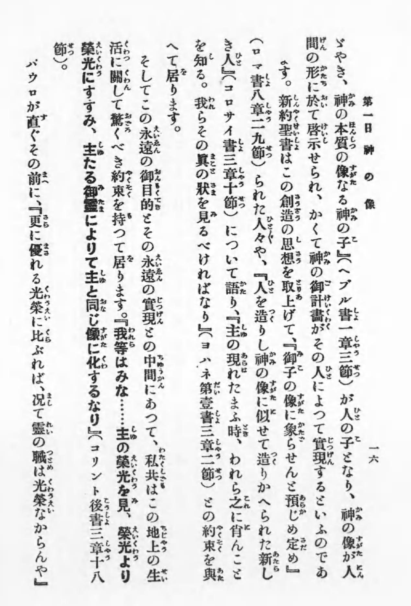
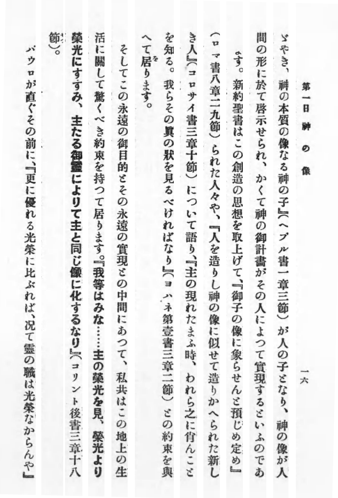

# kanaruby-remover

日本語の文章の画像からルビを除去するコマンドラインツール。

## Requirements

+ Phthon 3 系

## Installation

```sh
$ pip install numpy opencv-python
```

で依存関係を入れてから、 `bin` にパスを通す。

## Usage

画像の事前準備として、本文だけをトリミングしておく。

```sh
$ kanaruby_remover.py samples/samples01.png tmp/sample01_result.png
```

#### 入力画像



#### 出力画像


